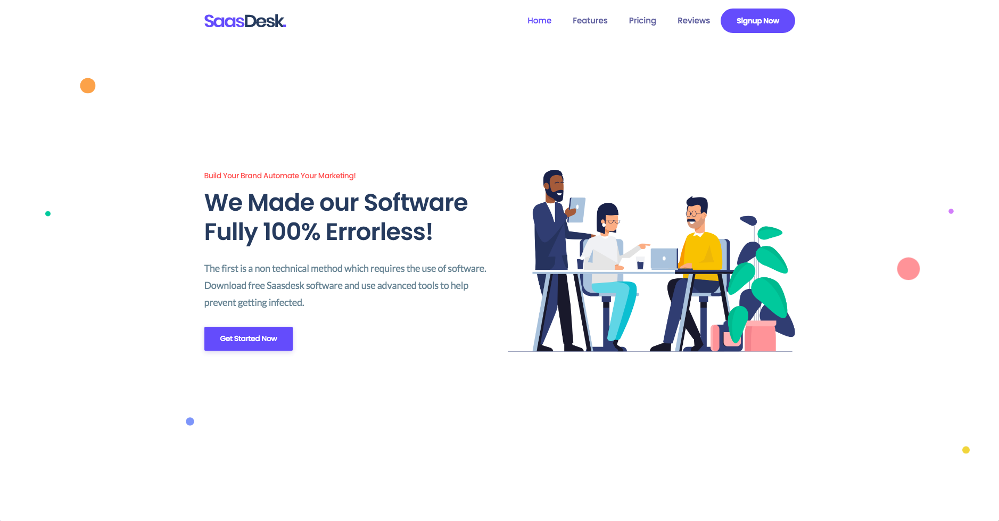

# Proyecto Kit Digital SaasDesk 2023

[](http://dev.pedrogarcia.gq/saasdesk/)

## Table of Contents:

- [OVERVIEW:](#overview)
  - [SERVICES:](#services)
- [PRICING:](#pricing)
  - [Classic Plan:](#classic-plan)
  - [Professional Plan:](#professional-plan)
  - [Business Ultimate Plan:](#business-ultimate-plan)
- [TEAMWORK:](#teamwork)
- [INVESTMENTS:](#investments)
- [REFERENCES:](#references)

---

## OVERVIEW:

Me gusta definir el proyecto como un híbrido entre **Consultoria Estrategica y Desarrollo Web Profesional.**
Dos campos fuertes que unidos _por la experiencia de los promotores fusionan_ a la perfección.

Partiendo de la landing page de referencia se puede hacer una idea del proyecto que abarcará servicios tales como:

### SERVICES:

- **ASANA®:**
  (Enlace Agilízador de trabajo interno. Múltiples funciones. Partner externo):
- **Web Design & Web Development:**
  Diseño UIX - Exclusivo para el cliente y Desarrollo para Planes más específicos.
- **Branding Digital para negocios:**
  Acompañamiento de marca. En caso de adaptación y/o rediseño nos ajustamos al cliente.
- **Marketing Profesional (Online y Offline):**
  Utilizando los canales actuales con un plan de 3 a 6 meses la empresa ya está posicionada en internet.
- **Publicidad online (S.E.O + S.E.M) y prospection:**
  SEM (Search Engine Marketing) y SEO (Search Engine Optimization) la marca junto al Plan adquirido reciben clientes en un ratio 1:3. SEM con Google Ads y Facebook Ads, TikTok Ads y Analytics. Campañas eficientes para clientes competitivos.

---

## PRICING:

El plan de precios o planes de susbscription está dividido en 3 procesos. Se hace con la [_pasarela de Pagos Stripe_](https://stripe.com/es), o similares:

### Classic Plan:

- Price: **47.97€/mo**
- Features:
  - Access to **Asana Membership:**
  - Landing page or SPA (HTML5, CSS + JS)
  - Reseller **Hosting Services + DNS Domain** included:
  - Monthly Maintenance:

### Professional Plan:

- Price: **87.97€/mo**
- Features:
  - Access **all features Classic Plan**.
  - **eMail Marketing** Professional:
  - Monthly Support Maintenance:

### Business Ultimate Plan:

- Price: **197.99€/mo**
- Features:
  - All **access to Professional Plan**:
  - eMail Marketing Professional:
  - **S.E.O + S.E.M and Ads campaings**:
  - Luxury ads management on Facebook and Google:
  - **Tracking of Customer + Ads + Prospection**:
  - A custom **eCommerce Membership Sites**:
  - A custom **CRM Dashboard** Apps:
  - Leads Marketing Services:

---

## TEAMWORK:

This group is composed of talented professionals and trained to carry out these projects:

The roles of the work team are defined below:

> #### Role Freelancer:

Employee or Freelancer Expert in Development (Commission 50/50 to project). The **next tools could be** used:

- _Remote working:_
- _Every three days make a meeting_:
- _Tasks assignment:_
- _Implementation of new Features:_
- _Days of Participation: MONDAY | WEDNESDAY | FRIDAY:_

> #### Role Manager or Producer:

Free Producer or Agent Single. According to % estimated: Incorporate once by week:

- _May join the meet once a week by election._
- _Tools can used:_
  - _Google Kit Apps:_
  - _[GitHub](https://github.com), [GitLab](https://gitlab.com) or [BitBucket](https://bitbucket.org/)_
  - _[Stripe](https://stripe.com/), Square or Any Gateaway Payments._
  - _Any Frameworks or Libs of Frontend JS:_
  - _A Code Editor [VSCode Suggested](https://code.visualstudio.com/)._
  - _Communication internal app: ([Whatsapp](https://web.whatsapp.com/), Email, [Slack](https://slack.com/intl/es-es/), [Telegram](https://telegram.org/))._

---

## INVESTMENTS:

The project's investment is made under a proform invoice, it's means, the amount of the supply, hardware or components for the project is required and the costs to receive the funds of the call is reflected.

There're essential requirements are:

- Being _Freelancer_, _SLU_ or any type of tax entity.
- The main idea of the project based on software and digital techs:

Inversión: Aprox.: 12.000€unos / 6000€unos / 3000€unos (según bases reguladoras)
ASANAR® : 24,99/ 30,49$ / Month = 365,88$ / 1year
Alojamiento + Dominio .COM: 30$ and/ Month = 360$ / 1 year

---

## REFERENCES:

- [Incubadora Proyectos - Clientes](https://acelerapyme.com)

- [Website References](http://dev.pedrogarcia.gq/zoric/index-1.html)

- [Detalles Convocatorias](https://sede.red.gob.es/es/procedimientos/convocatoria-de-ayudas-destinadas-la-digitalizacion-de-empresas-del-segmento-iii)

---

This is a [Next.js](https://nextjs.org/) project bootstrapped with [`create-next-app`](https://github.com/vercel/next.js/tree/canary/packages/create-next-app).

## Getting Started

First, run the development server:

```bash
npm run dev
# or
yarn dev
```

Open [http://localhost:3000](http://localhost:3000) with your browser to see the result.

You can start editing the page by modifying `pages/index.tsx`. The page auto-updates as you edit the file.

[API routes](https://nextjs.org/docs/api-routes/introduction) can be accessed on [http://localhost:3000/api/hello](http://localhost:3000/api/hello). This endpoint can be edited in `pages/api/hello.ts`.

The `pages/api` directory is mapped to `/api/*`. Files in this directory are treated as [API routes](https://nextjs.org/docs/api-routes/introduction) instead of React pages.

This project uses [`next/font`](https://nextjs.org/docs/basic-features/font-optimization) to automatically optimize and load Inter, a custom Google Font.

## Learn More

To learn more about Next.js, take a look at the following resources:

- [Next.js Documentation](https://nextjs.org/docs) - learn about Next.js features and API.
- [Learn Next.js](https://nextjs.org/learn) - an interactive Next.js tutorial.

You can check out [the Next.js GitHub repository](https://github.com/vercel/next.js/) - your feedback and contributions are welcome!

## Deploy on Vercel

The easiest way to deploy your Next.js app is to use the [Vercel Platform](https://vercel.com/new?utm_medium=default-template&filter=next.js&utm_source=create-next-app&utm_campaign=create-next-app-readme) from the creators of Next.js.

Check out our [Next.js deployment documentation](https://nextjs.org/docs/deployment) for more details.

## Cuantía de las ayudas:

El importe máximo de ayuda por beneficiario será de dos mil euros (2.000 €). Los importes máximos de ayuda por **Categoría de Soluciones de Digitalización**, así como la duración que debe mantenerse la prestación del servicio para el Segmento III son los siguientes:

## Sitio Web y Presencia professional en Internet:

Meses de prestación del servicio: 12
Ayuda para el Segmento II (0 ≤ X\*< 3 empleados): 2.000 €

## eCommerce Electronico:

Meses de prestación del servicio: 12
Ayuda para el Segmento II (0 ≤ X\*< 3 empleados): 2.000 €

Gestión de Redes Sociales:

Meses de prestación del servicio: 12
Ayuda para el Segmento II (0 ≤ X\*< 3 empleados): 2.000 €

## Gestión de Clientes:

Meses de prestación del servicio: 12
Ayuda para el Segmento II (0 ≤ X\*< 3 empleados): 2.000 € (incluye 1 usuario)

## Business Intelligence y Analítica:

Meses de prestación del servicio: 12
Ayuda para el Segmento II (0 ≤ X\*< 3 empleados): 1.500 € (incluye 1 usuario)

Gestión de Procesos:

Meses de prestación del servicio: 12
Ayuda para el Segmento II (0 ≤ X\*< 3 empleados): 2.000 € (incluye 1 usuarios)

Factura Electrónica:

Meses de prestación del servicio: 12
Ayuda para el Segmento II (0 ≤ X\*< 3 empleados): 1.000 € (incluye 1 usuarios)

Servicios y herramientas de Oficina Virtual:

Meses de prestación del servicio: 12
Ayuda para el Segmento II (0 ≤ X\*< 3 empleados): 250 € por usuario (hasta 2 usuarios)

Comunicaciones Seguras:

Meses de prestación del servicio: 12
Ayuda para el Segmento II (0 ≤ X\*< 3 empleados): 125 € por usuario (hasta 2 usuarios)

Ciberseguridad:

Meses de prestación del servicio: 12
Ayuda para el Segmento II (0 ≤ X\*< 3 empleados): 125 € por dispositivo (hasta 2 dispositivos)

Presencia avanzada en Internet:

Meses de prestación del servicio: 12
Ayuda para el Segmento II (0 ≤ X\*< 3 empleados): 2.000 €

Marketplace:

Meses de prestación del servicio: 12
Ayuda para el Segmento II (0 ≤ X\*< 3 empleados): 2.000 €
